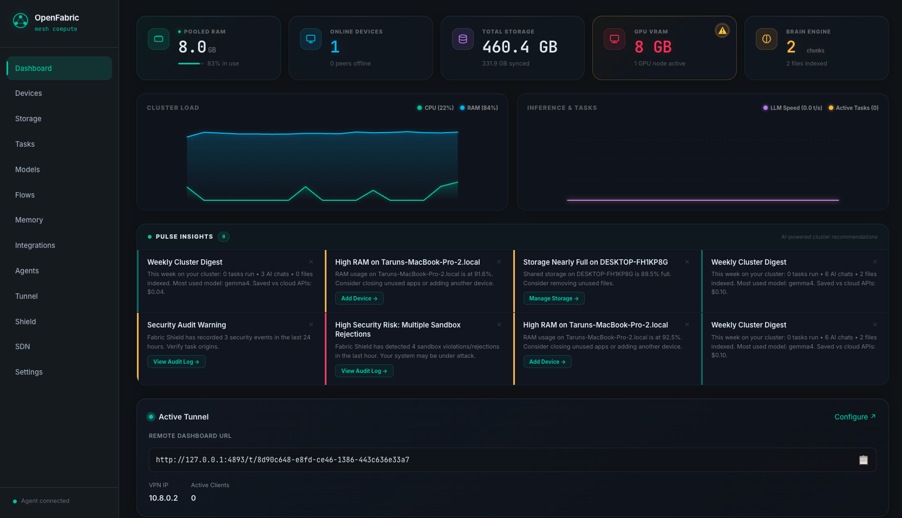

# OpenFabric


*(DEMO: Installing OpenFabric, 3 devices joining automatically, running distributed LLM inference, pooled GPU image generation, autonomous agent execution, and self-healing task rescheduling after unplugging a node)*

> **Your devices. One computer.**

Plug in a Raspberry Pi, an old laptop, and your Mac. They pool their RAM and storage, forming a secure local compute mesh. Run AI models too big for any single device. No configuration, no cloud, and no cloud billing.


---

OpenFabric distributes AI inference tasks across GPU nodes. It does not pool VRAM across GPUs (which requires NVLink/InfiniBand).
Each inference job runs on a single GPU node. OpenFabric routes the job to the node with the most available VRAM automatically.

---




## Install

**Mac** (Intel & Apple Silicon):
```sh
curl -fsSL https://raw.githubusercontent.com/tdev09/OpenFabric/main/scripts/install-mac.sh | sh
```

**Linux** (x86_64 & ARM64):
```sh
curl -fsSL https://raw.githubusercontent.com/tdev09/OpenFabric/main/scripts/install.sh | sh
```

**Raspberry Pi** (ARMv7 & ARM64):
```sh
curl -fsSL https://raw.githubusercontent.com/tdev09/OpenFabric/main/scripts/install.sh | sh
```

**Windows** - download the binary directly from the [latest release](https://github.com/tdev09/OpenFabric/releases/latest):
1. Download `fabric-windows-amd64.exe`
2. Open a terminal in the download folder and run: `.\fabric-windows-amd64.exe`
3. The dashboard opens automatically at `http://127.0.0.1:4892`

> The install scripts automatically fetch the latest release from `tdev09/OpenFabric`.  
> Pre-built binaries are available for: macOS (arm64, amd64), Linux (amd64, arm64, armv7), Windows (amd64).

---

## What It Does

OpenFabric ships with 26 core features fully implemented:

| Feature | Description | Status |
|---|---|---|
| **Auto-Discovery** | LAN device discovery via mDNS/Zeroconf without manual IP/port configs | Shipped |
| **Secure P2P** | Fully encrypted peer-to-peer transport using Noise (libp2p) | Shipped |
| **Pooled RAM** | Aggregated view of cluster CPU, memory, and disk resources | Shipped |
| **Intelligent Scheduler** | Multi-dimensional routing (RAM, CPU, latency, affinity, health) with circuit-breaking and priority queues | Shipped |
| **Empirical Sharding** | Shortest-path DP optimization layout solver using active background RTT, transfer bandwidth, and local token-generation speed metrics | Shipped |
| **Shared File System** | Decentralized filesystem with on-demand sync and availability locks | Shipped |
| **Local Dashboard UI** | Utilitarian dark-mode dashboard showing cluster stats via live SSE | Shipped |
| **Fabric Brain** | Local RAG engine indexing PDF/DOCX/TXT/CSV files with HNSW vector search | Shipped |
| **Fabric Flow** | Automation engine with template injection prevention, path containment checks, and history pruning | Shipped |
| **Instant Onboarding** | Frictionless device setup via shortcodes, CLI, browser links, or QR codes | Shipped |
| **Self-Healing** | Offline node detection within 5s, rescheduling tasks to online peers | Shipped |
| **Single Binary** | No Kubernetes, Docker, or external daemon dependencies required | Shipped |
| **Fabric Memory** | Encrypted-at-rest similarity fact store with prompt injection protection and auto-redacted extraction | Shipped |
| **Fabric Pulse** | Proactive resource monitors emitting real-time warning toasts via SSE | Shipped |
| **Fabric MCP** | Universal tool connector gateway via standard JSON-RPC 2.0 | Shipped |
| **Fabric Agents** | Autonomous ReAct loops executing safety-checked shell and web tools | Shipped |
| **Fabric GPU** | Stable GPU pooling with VRAM budgets, preemption, thermal-throttling, and Apple Silicon unified page-accounting | Shipped |
| **Fabric Tunnel** | Secure remote access with WireGuard, browser PIN rate-limiting, and HKDF-SHA256 encrypted token transport | Shipped |
| **Fabric SDN** | Cluster-wide segment isolation, firewall policies, QoS shaping, and routes defined via YAML | Shipped |
| **Fabric Shield** | Sandboxed process isolation, resource constraint limits, and tamper-evident cryptographic audit logs | Shipped |
| **Fabric Sandbox** | Secure platform-independent WebAssembly (WASI) task runner (`wazero`) with 128MB memory constraints, air-gapped network isolation, and virtualized storage mapping | Shipped |
| **Fabric Pipelines** | Multi-modal PCM audio streaming, native VAD silence segmentation, and dynamic chaining of transcribing, text, and image tasks across nodes | Shipped |
| **Fabric Swarms** | Decentralized agent actor model dynamically spawning and delegating tasks to sub-agents over a P2P message bus | Shipped |
| **Fabric Wake-on-LAN** | Network packet broadcaster and scheduler auto-wake loop on memory pressure | Shipped |
| **Fabric Reliability** | WAL crash recovery, retry backoffs with jitter, concurrent health checking, and expvar metrics | Shipped |
| **Fabric Bench** | Built-in benchmark suite measuring inference throughput, scheduler latency, storage sync, and node bandwidth | Shipped |
| **OpenAI Compatibility** | Drop-in compatibility (listening on `/v1`) for Continue.dev, Open WebUI | Shipped |

### Benchmarking
Measure hardware and cluster performance (scheduling, storage sync, round-trip, network, and inference speed) using the built-in benchmark runner:
```bash
# Run all benchmark suites
./dist/fabric bench --suite all

# Run specific suites (e.g. storage and scheduler)
./dist/fabric bench --suite storage,scheduler
```

---

## Why

OpenFabric was born out of frustration with the modern cloud and infrastructure landscape. Today, if you want to run a local LLM or distribute a workload across a few spare machines in your home or office, you are forced to choose between complex enterprise orchestrators like Kubernetes, or manually managing files and configurations over SSH. We wanted a solution that felt as seamless as AirDrop: you turn it on, your devices discover each other, and they immediately form a single unified pool of compute.

By leveraging decentralized peer-to-peer networking (libp2p) and zero-config local discovery (mDNS), OpenFabric makes cluster computing accessible to everyone. Your data stays entirely local on your own hardware, with zero dependency on external cloud providers. It is privacy-first, zero-config, and self-healing by design-bringing the power of a personal supercomputer to your local network.

---

## Security Model

- **Device Identity**: Every node has a permanent Ed25519 keypair generated on first run, stored in `~/.openfabric/identity.json`.
- **P2P Encryption**: All peer-to-peer communication is encrypted via libp2p's Noise protocol (same as WireGuard).
- **HMAC Challenge Handshake**: All discovered nodes undergo an `HMAC-SHA256` challenge handshake to verify knowledge of the cluster secret before P2P stream establishment, preventing rogue devices on public networks from joining.
- **Transport Security & Connection Tokens for Joining Nodes**: Onboarding joining nodes uses secure base64-encoded Connection Tokens (`ofj_...`) carrying PeerIDs and dialable multiaddresses. Authentication is verified via an HMAC-SHA256 challenge-response handshake over a dedicated libp2p stream protocol (`/openfabric/join/1.0.0`), and the coordinator cluster secret is encrypted via AES-256-GCM with HKDF-SHA256 derived keys from the ephemeral token, preventing plaintext network sniffing.
- **Local API Binding**: The REST API binds to `127.0.0.1:4892` only. It is never exposed to the external network interface.
- **Task Sandbox & Allowlist Validation**: Task execution is sandboxed using split-command parsing, rejecting redirection (`>`, `<`), subshells (`$()`, backticks), and any command not on the configured allowlist. The sandbox checks are executed *both* at task submission and immediately before invocation on the worker node.
- **WebAssembly Sandboxed Execution (Fabric Sandbox)**: Executes user tasks inside a pure-Go WASM runtime (`wazero`) with a 128MB memory limit, air-gapped networking (socket interfaces disabled), and absolute containment where directories are virtualized to the shared `/storage` path.
- **At-Rest Memory Encryption**: Stored memory facts are encrypted at rest using **AES-256-GCM** inside `memories.json` to protect sensitive data on shared disks.
- **Redacted Chat Fact Extraction**: Background LLM fact extraction automatically redacts private credentials (API keys, SSH keys, passwords, private IPv4 ranges) before prompts are sent to local models.
- **RAG Prompt Injection Mitigation**: Injected memories are wrapped in strict XML delimiters (`<user_profile_facts>`) alongside a system prompt instruction prohibiting the LLM from executing commands found within. Suspicious facts containing instruction-hijacking patterns are silently dropped.
- **Flow Command Isolation**: Flows execute shell templates by passing prior step outputs strictly as environment variables, preventing command string template injections.
- **Path Traversal Containment**: All file operations (Storage APIs, Gossip Sync downloads, Flow StepSave target paths) are validated using `filepath.Rel` checks against the storage root path.
- **Fabric SDN Security & Isolation**: Automates fail-safe high-priority whitelists for local loopback and critical cluster services (ports 4892, 4893, 5353) to prevent lockout, and falls back to a userspace in-memory stub data plane on unprivileged nodes.
- **Air-Gapped Operation**: No telemetry, third-party updates, or cloud pings. Data stays in your home or office.

---

## Self-Healing Behavior

| Event | What happens |
|---|---|
| **Node goes offline** | Gossip heartbeats timeout within 5s. Running tasks on that node are automatically re-queued and rescheduled on active nodes. |
| **Network partition** | Partitions continue running independently. When reconnected, the CRDT metadata registry merges changes conflict-free. |
| **Node comes back online** | Auto-rejoins the cluster, syncs missing files, and resumes accepting tasks. |
| **All nodes offline** | Cluster state is preserved locally on disk. Re-forms automatically when devices reappear on the same local network. |

---

## Competitive Landscape

| Capability | exo | OpenClaw | AnythingLLM | Open WebUI | **OpenFabric** |
|---|---|---|---|---|---|
| **Distributed Inference** | ✓ | ✗ | ✗ | ✗ | **✓** |
| **MCP Tool Connectivity** | ✗ | ✓ | ✗ | Partial | **✓** |
| **Autonomous Agents** | ✗ | ✓ | ✗ | ✗ | **✓** |
| **Decentralized Agent Swarms** | ✗ | ✗ | ✗ | ✗ | **✓** |
| **Multi-Modal Pipelines** | ✗ | ✗ | ✗ | ✗ | **✓** |
| **Fabric Shield (Sandbox & Audit)** | ✗ | ✗ | ✗ | ✗ | **✓** |
| **WASM Task Sandbox** | ✗ | ✗ | ✗ | ✗ | **✓** |
| **GPU Pooling + Image Gen** | ✗ | ✗ | ✗ | ✗ | **✓** |
| **Distributed RAG** | ✗ | ✗ | Single device | Single device | **✓** |
| **Zero Configuration** | ✗ | Partial | ✓ | Partial | **✓** |
| **Automation Scheduler** | ✗ | ✗ | ✗ | ✗ | **✓** |
| **Secure Remote Access** | ✗ | ✗ | ✗ | ✗ | **✓** |
| **Software Defined Networking (SDN)** | ✗ | ✗ | ✗ | ✗ | **✓** |
| **Wake-on-LAN** | ✗ | ✗ | ✗ | ✗ | **✓** |
| **Fault Tolerance / WAL Recovery** | ✗ | ✗ | ✗ | ✗ | **✓** |
| **Cross-Platform Support**| ✗ Mac only | Partial | ✓ | ✓ | **✓** |

---

## Development Guide

### Prerequisites
- Go 1.22+
- Node.js 20+ (for SvelteKit UI compilation)
- Make

### Building from Source
```bash
git clone https://github.com/tdev09/OpenFabric.git
cd OpenFabric

# Build UI and compile the unified agent binary
make build

# Start the agent
./dist/fabric
```

### Development Commands
```bash
make dev-agent   # Start Go agent in hot-reload verbose dev mode
make dev-ui      # Start SvelteKit hot-reload frontend (proxies to :4892)
make test        # Run all test suites
make lint        # Run golangci-lint checking code quality rules
```

---

## API Specification

The agent exposes a local-only REST + SSE API on `localhost:4892`. For a complete, structured reference of all subsystem endpoints (Cluster, Storage, LLM/Inference, Flows, MCP, Agents, GPU, Tunnel, WoL, and Benchmarks), please see the [API Specification Document](docs/api.md).

## Contributing

We welcome community contributions. Please ensure all modifications follow our strict code guidelines:
- **Documentation**: Every exported function, struct, and type must be commented with a single line.
- **Function Size**: No function should exceed 60 lines. Long operations must be split.
- **Errors**: Every error must be explicitly handled. Silent swallows are not allowed.
- **Dependencies**: Consult in issues before introducing new external modules.

---

## License

MIT. Free forever. Use it, modify it, build on it.
